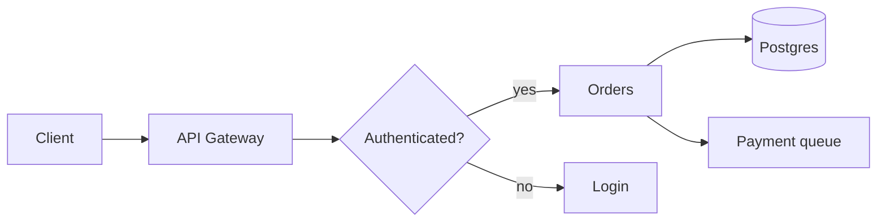
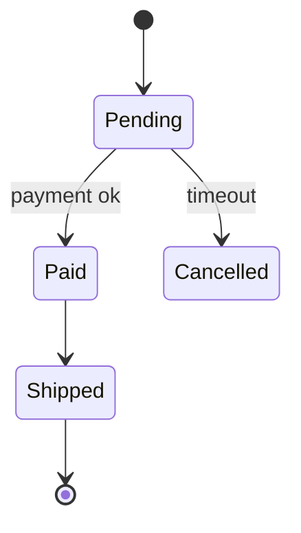

# shop-api

Order service for the shop.

## Request flow

```mermaid
graph LR
    C[Client] --> G[API Gateway]
    G --> A{Authenticated?}
    A -->|yes| O[Orders]
    A -->|no| L[Login]
    O --> DB[(Postgres)]
    O --> Q[Payment queue]
```

## Order states

```mermaid
stateDiagram-v2
    [*] --> Pending
    Pending --> Paid: payment ok
    Pending --> Cancelled: timeout
    Paid --> Shipped
    Shipped --> [*]
```
